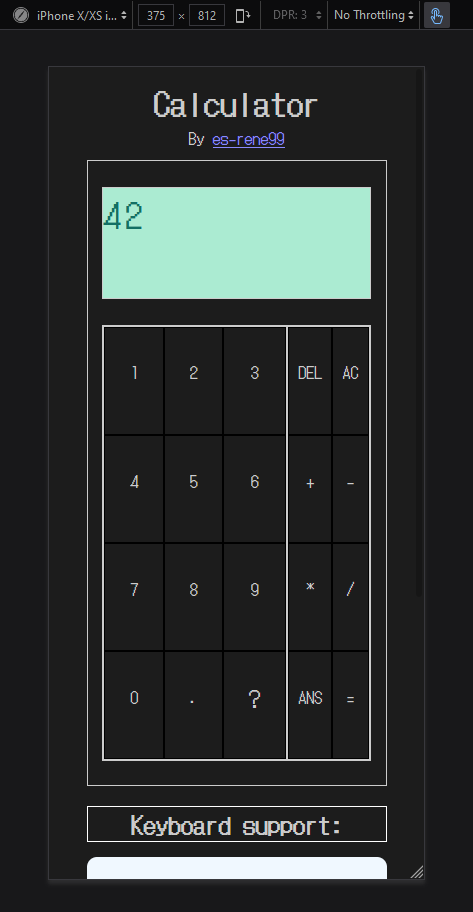
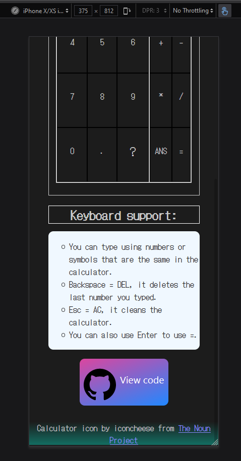

# JS Calculator

 

<table align="center" border="0" >
  <tr>
    <td>
      
    </td>
    <td>
      
    </td>
  </table>
  

One of my projects from [TOP curriculum](https://www.theodinproject.com/) to polish my JS skills, it works both on mobile and desktop.
